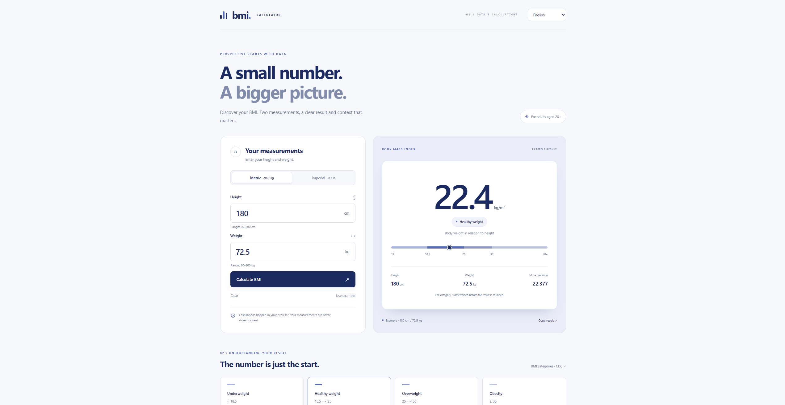

# ⚖️ BMI Calculator - Health Metric App & QA Portfolio



> **About the project:** BMI Calculator is an interactive, lightweight web application designed to calculate Body Mass Index and provide immediate health status feedback. This repository serves as a core artifact in my Quality Assurance (QA) portfolio, showcasing a "Shift-Left" testing approach. It demonstrates clean JavaScript architecture, unit testing, internationalization (i18n), and comprehensive test documentation[cite: 17].

[Open app ↗]()


## ✨ Core Features

* **Precise Calculations:** Accurately computes Body Mass Index based on user height and weight inputs.
* **Health Status Classification:** Dynamically categorizes results (e.g., Underweight, Normal, Overweight, Obese) based on mathematical thresholds.
* **Multi-language Support (i18n):** Seamlessly switchable user interface languages for global accessibility[cite: 17].
* **Form Validation:** Prevents invalid inputs (negative numbers, strings, empty fields) with real-time user feedback.
* **Responsive UI:** Clean, mobile-friendly design ensuring a great user experience across devices[cite: 17].

## 🧪 QA Approach & Test Structure

As a QA Automation Engineer, I prioritized code testability, edge-case handling, and rigorous business logic verification:

* **QA Documentation:** Comprehensive manual test scenarios, edge cases (e.g., extreme values, zero inputs, non-numeric characters), and exploratory findings are detailed in the `QA.md` report[cite: 17].
* **Unit Testing:** The core calculation logic and state management are strictly verified through automated unit tests located in `tests/model.test.cjs`[cite: 17].
* **Architecture for Testability:** The codebase purposefully separates the business logic layer (`model.js`, `translations.js`)[cite: 17] from the DOM manipulation layer (`app.js`)[cite: 17]. This MVC-like separation allows for highly isolated, reliable automated testing.

## 📂 Repository Architecture

* `index.html` / `styles.css` – Semantic markup and modern styling for the application interface[cite: 17].
* `app.js` – Main view controller, handling DOM events and user interactions[cite: 17].
* `model.js` – Business logic model responsible for mathematical BMI calculations and state validation[cite: 17].
* `translations.js` – Internationalization module containing multi-language dictionaries[cite: 17].
* `tests/model.test.cjs` – Automated unit test suite verifying the mathematical accuracy and error handling of the model[cite: 17].
* `QA.md` – Professional QA documentation containing bug reports and test execution summaries[cite: 17].

## 🚀 Running the Local Environment

To run the application and execute the test suite locally, follow these steps:

### 1. Launching the App
The application is built with Vanilla JavaScript and requires no build steps. Clone the repository and open `index.html` in your preferred modern web browser (using a *Live Server* extension is recommended for the best experience).

### 2. Running Automated Tests
Ensure you have **Node.js** installed on your machine. Open your terminal in the project root directory and execute:
```bash
npm install
npm test
